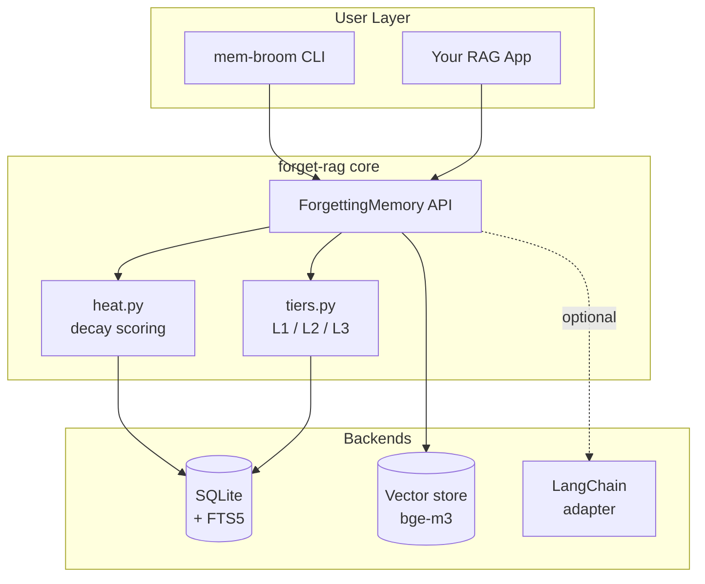
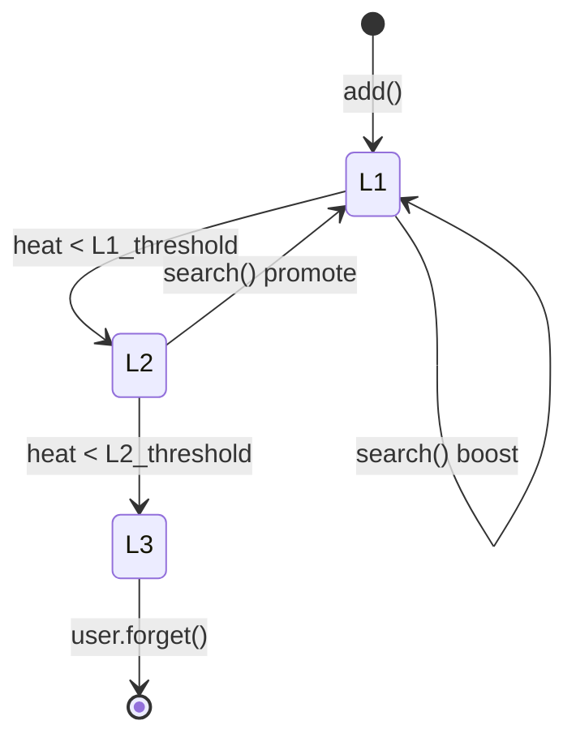
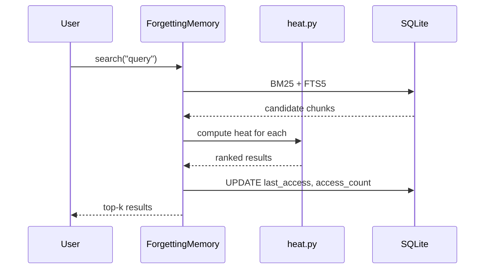

[English](architecture.md) | [繁體中文](architecture.zh-TW.md)

# Architecture

## High-level

## Tier transitions

| Tier | Storage | Searchable via | Cost |
|------|---------|---------------|------|
| L1   | Vector + FTS5 | Hybrid (BM25 + vector) | Highest |
| L2   | FTS5 only | BM25 only | Medium |
| L3   | Archived JSON | Explicit lookup only | Lowest |

## Search data flow

