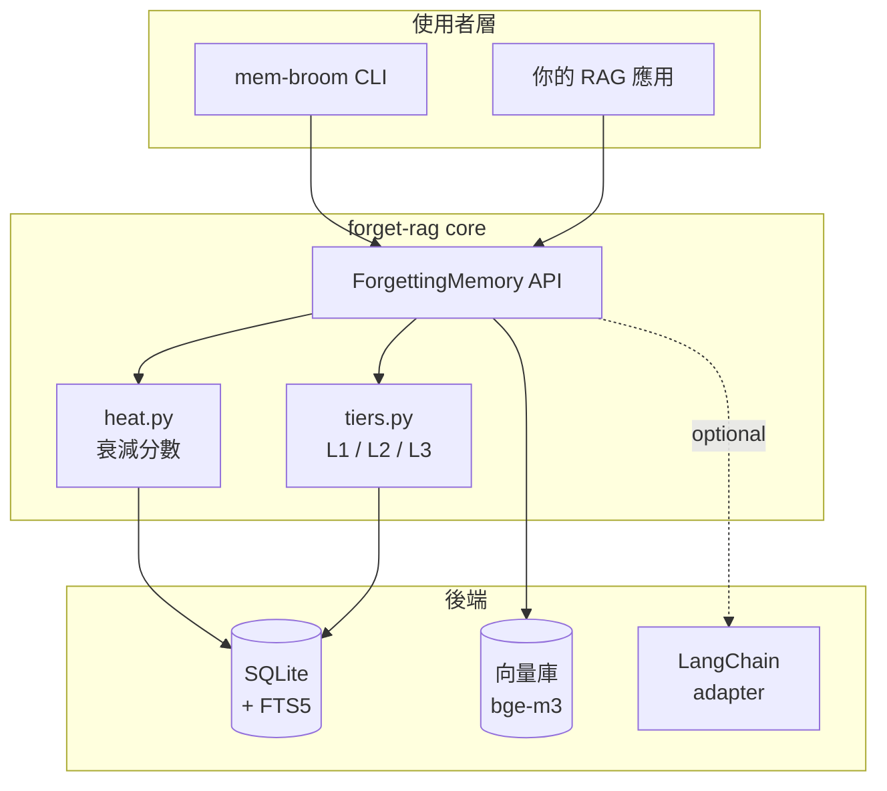
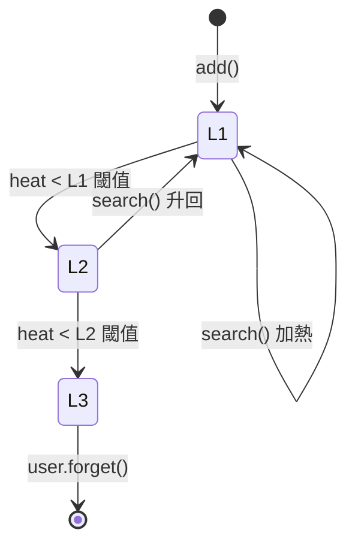
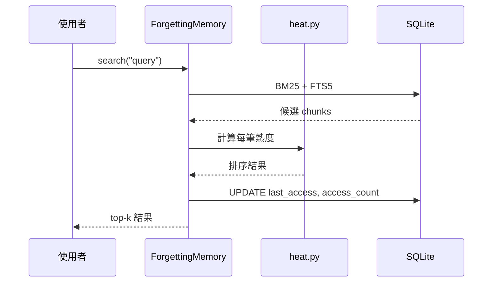

[English](architecture.md) | [繁體中文](architecture.zh-TW.md)

# 架構

## 高階架構

## 分層轉移

| 層級 | 儲存 | 可搜索 | 成本 |
|------|------|-------|------|
| L1   | 向量 + FTS5 | 混合（BM25 + 向量） | 最高 |
| L2   | 只剩 FTS5 | 只剩 BM25 | 中等 |
| L3   | JSON 歸檔 | 需明確查詢才找得到 | 最低 |

## 搜尋資料流

